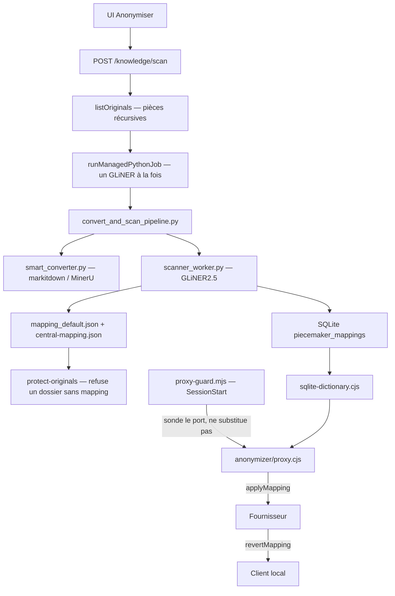

# Anonymisation PieceMaker — chemin retenu

Un seul enchaînement construit le mapping et un seul point de passage code
les messages. Le modèle ne voit que des codes ; le cabinet ne voit que des
noms. Les fichiers restent en clair sur le disque.

La conversion Markdown seule (`POST /originals/pipeline` action `convert`)
n’appartient pas à ce chemin : elle ne scanne pas et n’alimente pas le proxy.

---

## Vue d’ensemble

---

## 1. Lancement

Surfaces : `AnonymizationLauncher`, `CaseMappingSetup`, `CaseFilesChronology`,
plugin dossier. Toutes posent `POST /api/piecemaker/knowledge/scan`
(`createKnowledgeRouter`, `createKnowledgeService.scan`).

Le service démarre un job (`createKnowledgeScanJobs`) puis appelle
`createKnowledgePipeline.scan`. Un scan déjà en cours sur le même projet est
réutilisé. Deux dossiers distincts partagent le verrou GLiNER de
`runManagedPythonJob` : le second attend.

Sans liste de fichiers, `defaultScanFiles` réutilise `listOriginals` : arborescence
complète, hors Markdown généré, hors ressources. `--skip-existing` évite de
recharger GLiNER sur un dossier déjà scanné. Une liste explicite force le
retraitement de ces pièces.

## 2. Markitdown / GLiNER

`runManagedPythonJob` lance `convert_and_scan_pipeline.py` (exclusivité GLiNER,
budget RAM, nice, timeout).

- Phase CONVERT : `smart_converter.py` (`auto` → markitdown si couche texte,
  MinerU sinon).
- Phase SCAN : `scanner_worker.py` charge GLiNER2.5 **une fois**,
  puis scanne chaque Markdown (protocole JSON-line). Les cartes brutes
  (`*_sensitive_map.json`) restent dans un répertoire temporaire et sont
  détruites après fusion.

État technique : `.piecemaker/anonymization-state.json` et
`.piecemaker/document-index.json` du dossier, pas un temp jeté.

## 3. SQLite et mapping disque

Après un scan réussi, le pipeline fait les deux écritures :

| Cible | Module | Consommateur |
| --- | --- | --- |
| `piecemaker_mappings` / `piecemaker_nodes` | `persistScanResult` | proxy PII (`createSqliteDictionaryLoader`) |
| `Fichiers convertis PieceMaker/mapping_default.json` | `writeCaseMapping` | `protect-originals` (`caseHasMapping`), Cursor |
| `~/.piecemaker/central-mapping.json` | `syncCentralMapping` | garde Cursor, rechargement historique |

Sans le JSON, le hook PreToolUse traiterait le dossier comme non anonymisé.
Sans SQLite, le proxy relayerait en clair.

## 4. Hook proxy PII

`scripts/piecemaker/hooks/proxy-guard.mjs` (SessionStart Claude / Codex).

Il **ne substitue pas**. Il sonde le port du proxy (`mikePiiPort`, défaut 4111)
et, s’il est mort, retire `ANTHROPIC_BASE_URL` / le bloc Codex pour éviter une
boucle vers un port fermé. Fail-open : session en accès direct + avertissement.

La substitution n’a jamais lieu dans un hook. `protect-originals.mjs` refuse
les originaux protégés et un dossier sans `mapping_default.json`.

## 5. Proxy PII

Démarré avec le serveur (`createAnonymizerService`, `startRequiredAnonymizer`).
Pas de LiteLLM, pas de process Python dédié.

- Sortant : `anonymize` → `applyMapping` (`substitution.cjs`, plus longue
  entité d’abord, frontières Unicode).
- Entrant : `deanonymize` → `revertMapping`, y compris SSE fragmenté
  (`rewrite.cjs`, `createSseRewriter`).
- Dictionnaire : SQLite, rechargé sur `data_version`. Mapping vide = relais
  transparent.

Routes : `/anthropic` (Claude), `/chatgpt` (Codex), `/openai` (opencode).
Cursor n’est pas interceptable : bloqué tant qu’un mapping existe.

---

## Performance du scan

Inférence officielle GLiNER2 : **PyTorch**. CUDA s’il y a un GPU NVIDIA, sinon
CPU. Pas de CoreML (API Apple, hors doc Fastino).

Le temps est dans l’encodeur, pas dans le glue Python. `--skip-existing` évite
de recharger GLiNER sur un dossier déjà scanné. `classify_text` par occurrence
a été retiré ; il reste un appel sur l’en-tête (nature / date).

---

## Invariants

- Un seul worker GLiNER à la fois, tous dossiers confondus.
- Substitution triée de l’entité la plus longue à la plus courte.
- Un code n’est jamais réattribué ; les collisions inter-dossiers sont
  dé-conflictées dans `sqlite-dictionary.cjs`.
- Les originaux ne quittent pas le dossier ; seuls Markdown + codes partent
  vers le modèle.
- Le harnais de citations observe le clair **avant** anonymisation et **après**
  ré-identification (`harness-legal.md`).
